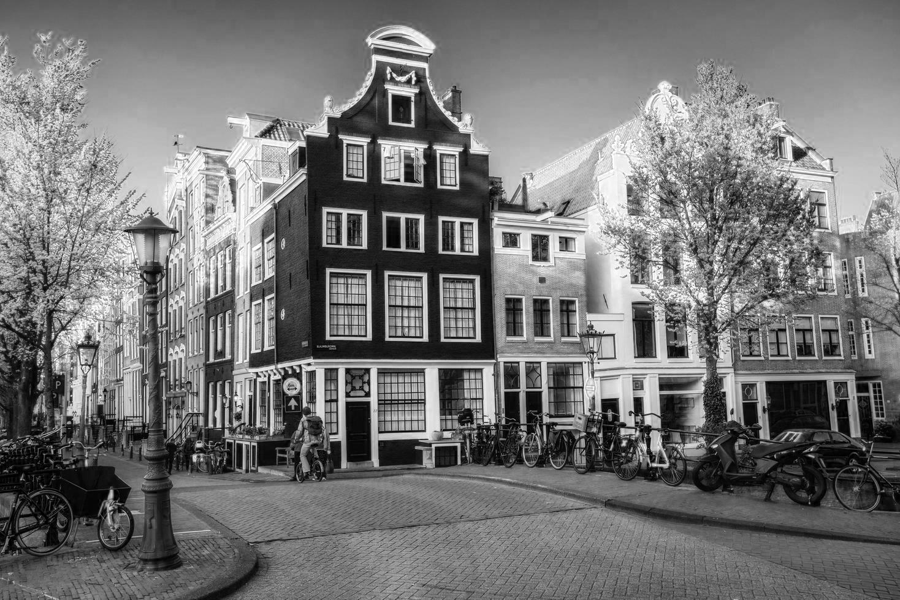
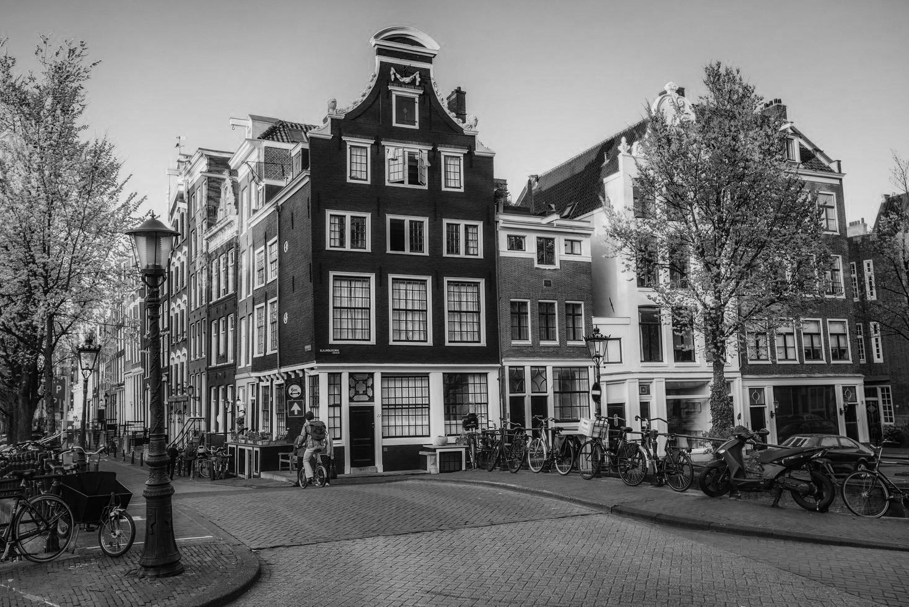
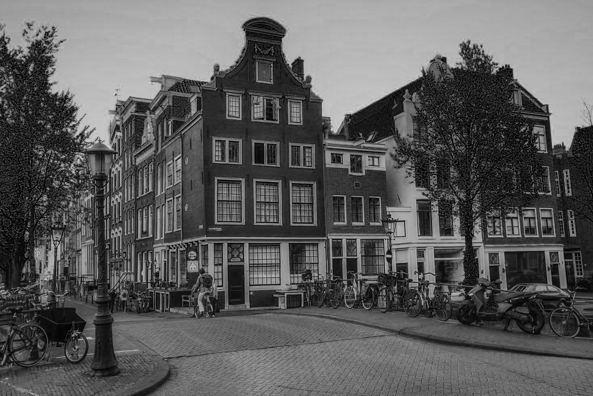
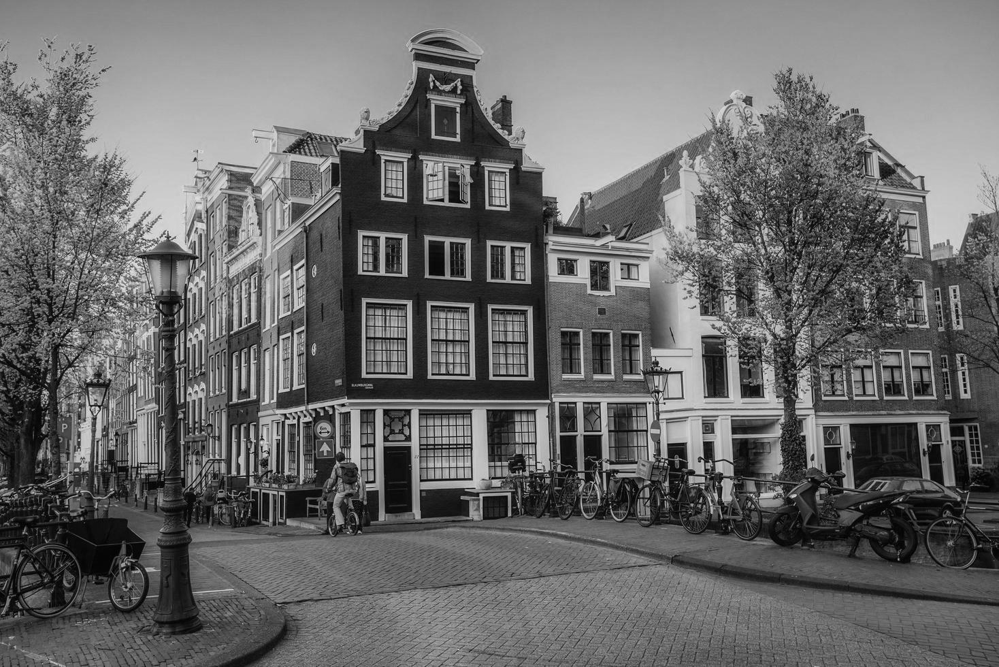
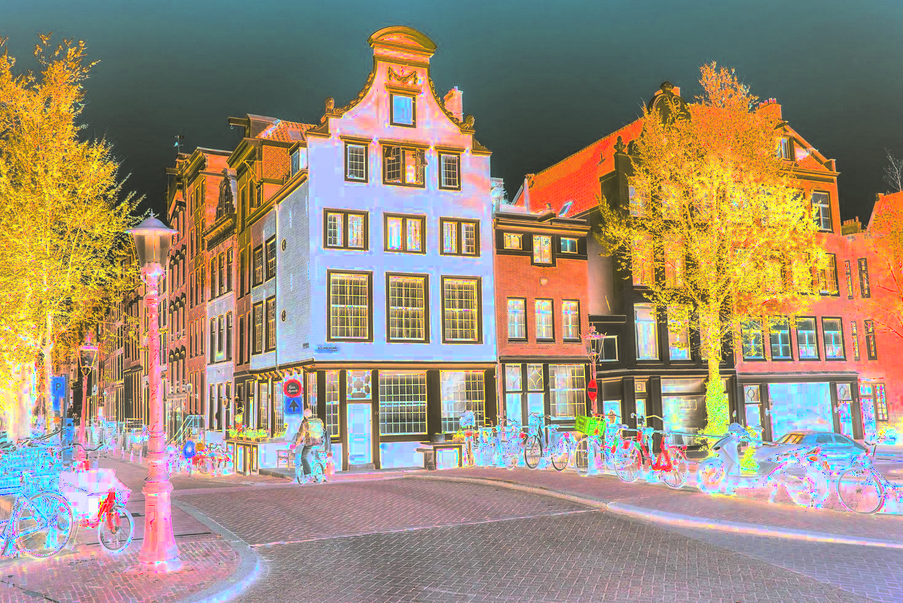
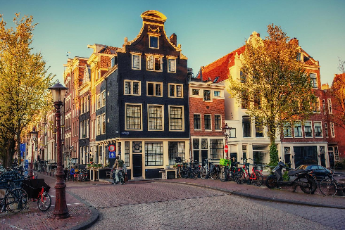
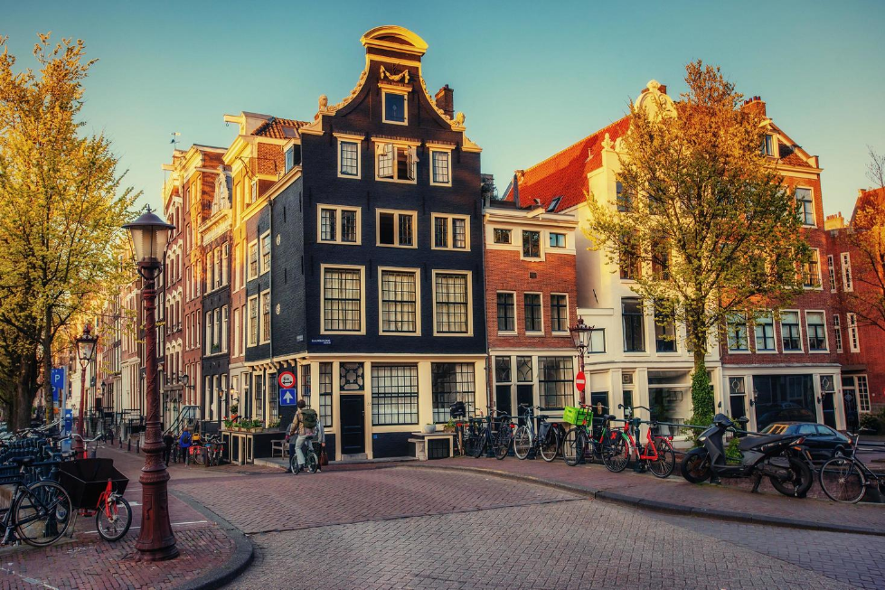

# Лабораторная работа №1
## Цветовые модели и передискретизация изображений

### Исходное изображение

### 1. Компоненты RGB

| R | G | B |
|:--:|:--:|:--:|
|  |  |  |

### 2. Яркостная компонента и инверсия

| HSI intensity | Инвертированная яркость |
|:-------------:|:-----------------------:|
|  |  |

### 3. Передискретизация

Параметры: `M = 2`, `N = 3`, `K = 0.6667`.

| Растяжение x2 | Прореживание x3 |
|:-------------:|:---------------:|
|  |  |

| Двухпроходная передискретизация | Однопроходная передискретизация |
|:-------------------------------:|:-------------------------------:|
|  |  |

### 4. Результаты

| Операция | Размер |
|:---------|-------:|
| Исходное изображение | 1468×980 |
| Растяжение x2 | 2936×1960 |
| Прореживание x3 | 490×327 |
| Двухпроходная передискретизация | 979×654 |
| Однопроходная передискретизация | 979×653 |

### Вывод

Выделены компоненты `R`, `G`, `B`, получена яркостная компонента `HSI` и изображение с инвертированной яркостью. Выполнены растяжение, сжатие, двухпроходная и однопроходная передискретизация; получены итоговые изображения с коэффициентом `K = 2 / 3`.
