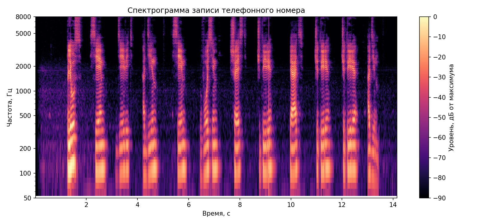
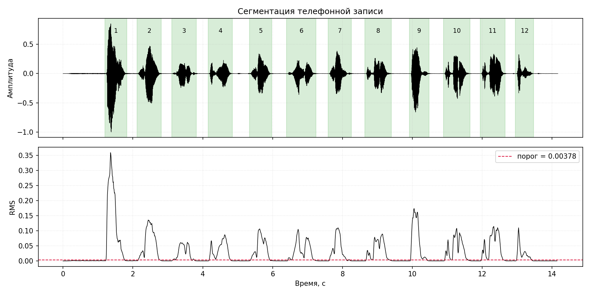
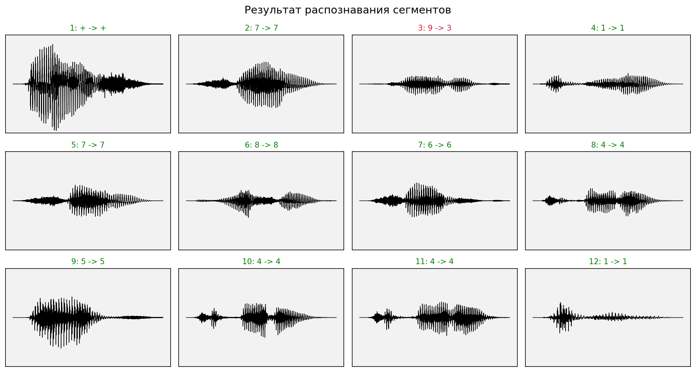

# Лабораторная работа №10
## Вариант 17. Анализатор речи

Выполнен вариант 3: распознавание телефонного номера по алфавиту из слов `ноль`, `один`, ..., `девять` и `плюс`. Исходные одноканальные WAV-файлы находятся в [alphabet](lab10/alphabet).

Ожидаемая последовательность из :

`плюс 7 9 1 7 8 6 4 5 4 4 1`

### Метод

Телефонная запись `phone.wav` сегментирована по кратковременной энергии `RMS`. Для каждого сегмента и каждого эталона алфавита рассчитаны MFCC-подобные признаки:

- окно анализа: `25 мс`;
- шаг окна: `10 мс`;
- `NFFT = 2048`;
- число mel-полос: `32`;
- число MFCC-признаков без нулевого коэффициента: `13`.

Сегмент сопоставляется с эталоном методом динамического выравнивания времени `DTW`. В качестве оценки достоверности используется относительный отрыв первой гипотезы от второй.

### Спектрограмма телефонной записи

### Сегментация

Найдено `12` сегментов, что совпадает с количеством слов в ожидаемой последовательности.

### Результаты распознавания

| Показатель | Значение |
|:--|--:|
| Частота дискретизации | `48000 Гц` |
| Длительность телефонной записи | `14.165 с` |
| Размер алфавита | `11` |
| Количество сегментов | `12` |
| Ошибок | `1` |
| Точность | `91.667%` |
| Средняя достоверность | `21.281%` |
| Минимальная достоверность | `0.658%` |

Распознанная последовательность:

`plus 7 3 1 7 8 6 4 5 4 4 1`

| № | Ожидалось | Распознано | Достоверность | Верно |
|--:|:--:|:--:|--:|:--:|
| 1 | `plus` | `plus` | `35.734%` | да |
| 2 | `7` | `7` | `29.824%` | да |
| 3 | `9` | `3` | `0.658%` | нет |
| 4 | `1` | `1` | `20.404%` | да |
| 5 | `7` | `7` | `10.953%` | да |
| 6 | `8` | `8` | `21.646%` | да |
| 7 | `6` | `6` | `15.474%` | да |
| 8 | `4` | `4` | `13.186%` | да |
| 9 | `5` | `5` | `20.663%` | да |
| 10 | `4` | `4` | `23.619%` | да |
| 11 | `4` | `4` | `34.247%` | да |
| 12 | `1` | `1` | `28.966%` | да |

### Вывод

Для варианта 3 подготовлен алфавит из `11` речевых образцов и выполнена сегментация записи телефонного номера. Сегментация выделила все `12` слов. Распознавание по MFCC-подобным признакам и DTW дало `11` верных ответов из `12`; единственная ошибка возникла на третьем сегменте, где ожидаемая цифра `9` была распознана как `3`. Низкая достоверность этого решения (`0.658%`) показывает, что гипотезы для данного сегмента близки и участок является неоднозначным для выбранного набора признаков.
