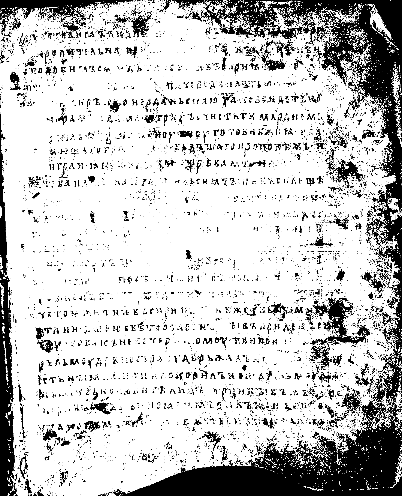
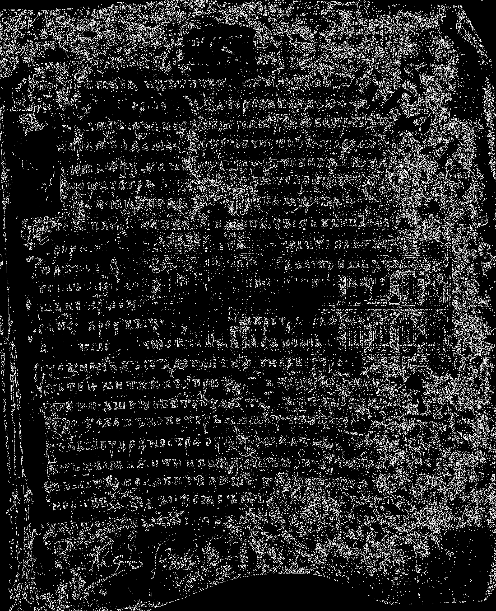
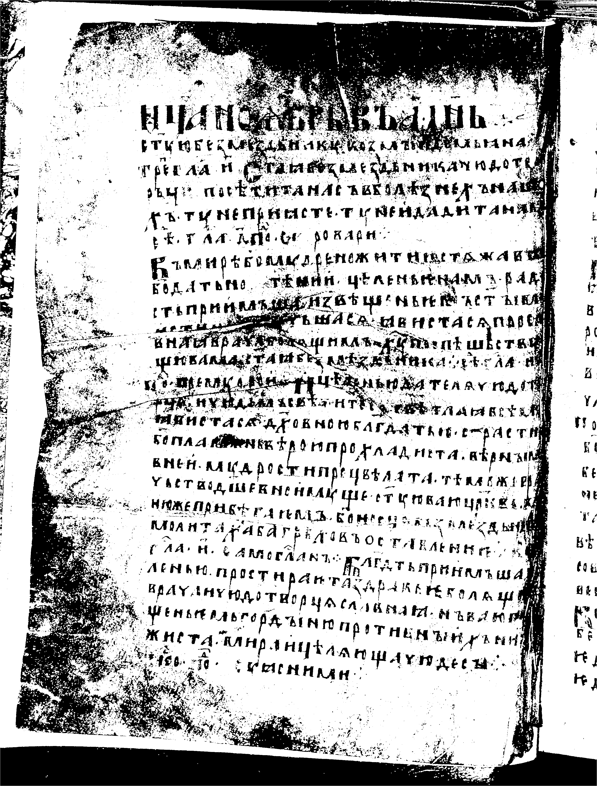
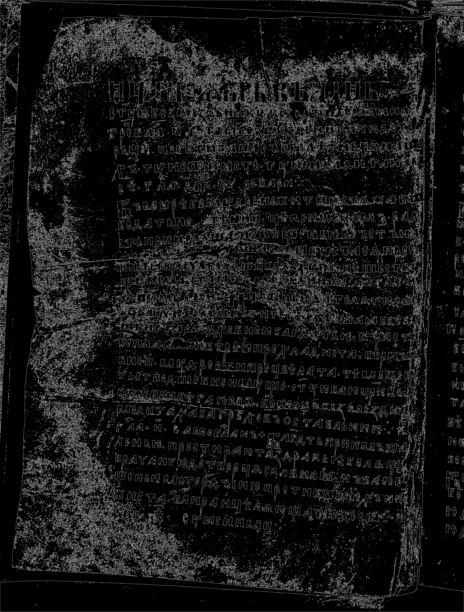

# Лабораторная работа №3
## Вариант 17. Морфологическое сжатие (эрозия), структурирующий элемент — квадрат 3×3

Для изображений `01.png` и `02.png` выполнены перевод в полутон, бинаризация и морфологическая эрозия квадратным структурирующим элементом `3×3`. Дополнительно построено разностное изображение `XOR`.

### Изображение 01

| Исходное | После эрозии | Разность |
|:--------:|:------------:|:--------:|
|  |  |  |

### Изображение 02

| Исходное | После эрозии | Разность |
|:--------:|:------------:|:--------:|
|  |  |  |

### Вывод

Эрозия уменьшила светлые области бинарного изображения и убрала часть мелких деталей. Разностное изображение показало пиксели, изменившиеся после применения операции.
