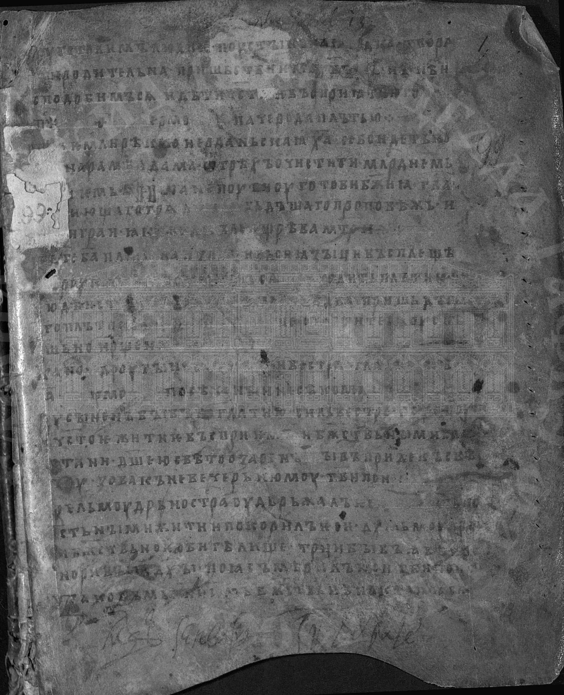
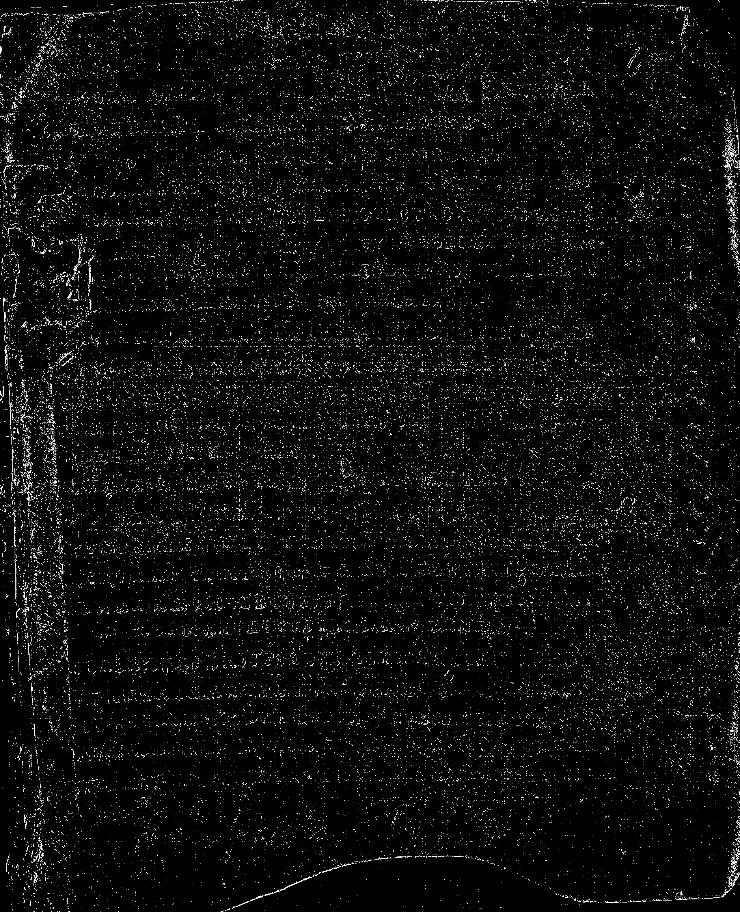
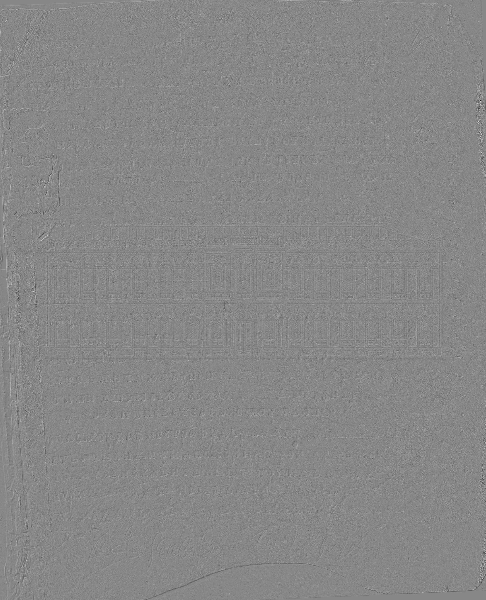
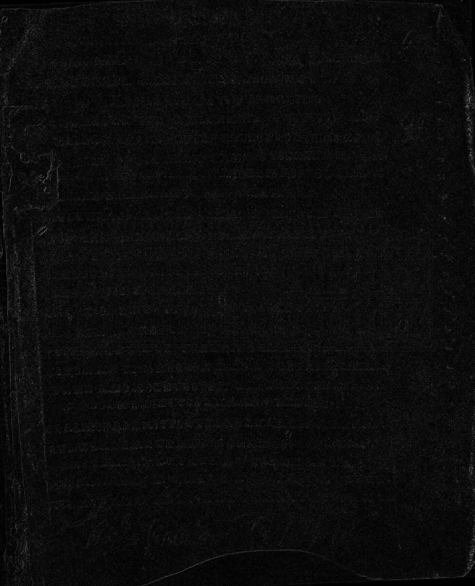
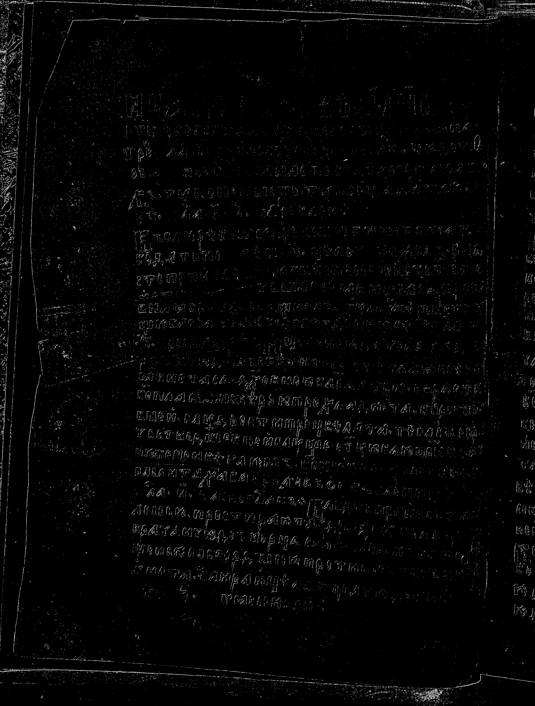

# Лабораторная работа №4
## Вариант 1. Выделение контуров оператором Робертса 2×2

Для изображений `01.png` и `02.png` выполнены перевод в полутоновое изображение, вычисление градиентных составляющих `Gx`, `Gy`, модуля градиента `G` и бинарной карты контуров. Порог бинаризации: `T = 35`.

### Изображение 01

| Исходное | Полутоновое | Бинарное |
|:--------:|:-----------:|:--------:|
|  |  |  |

| Gx | Gy | G |
|:--:|:--:|:--:|
|  |  |  |

### Изображение 02

| Исходное | Полутоновое | Бинарное |
|:--------:|:-----------:|:--------:|
|  |  |  |

| Gx | Gy | G |
|:--:|:--:|:--:|
|  |  |  |

### Вывод

Для варианта 1 реализован оператор Робертса 2×2. Получены карты градиента по двум направлениям, модуль градиента и бинарные контурные изображения для двух исходных файлов.
