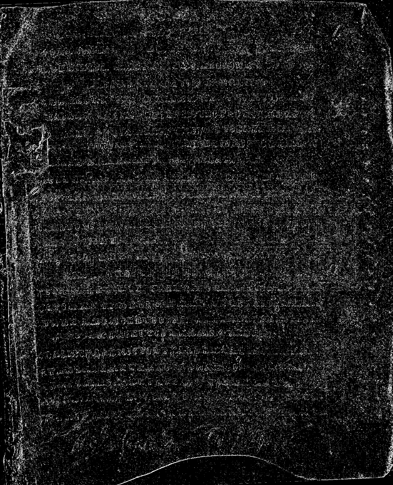
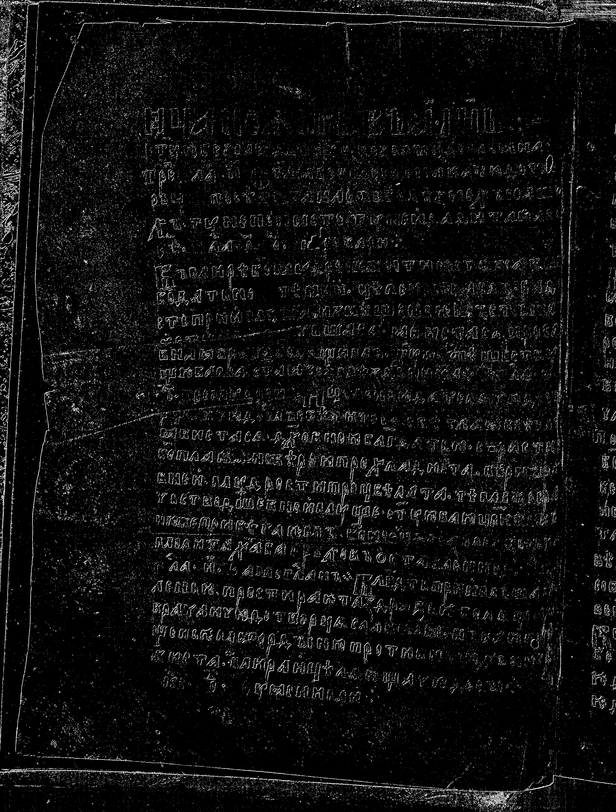
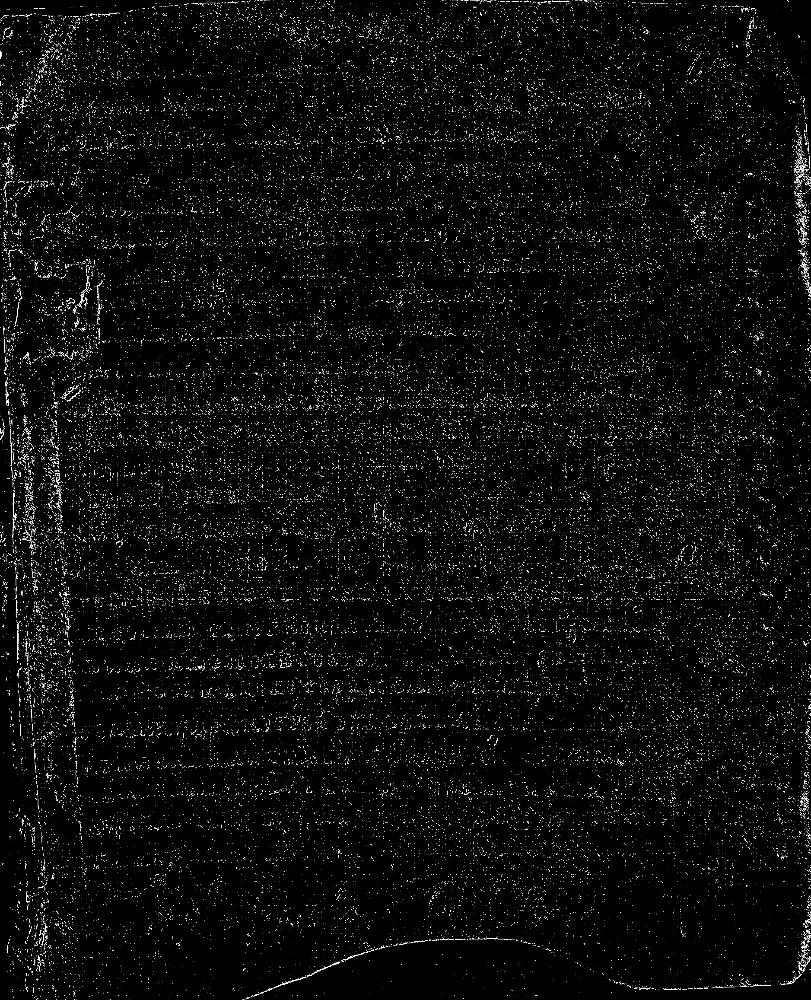
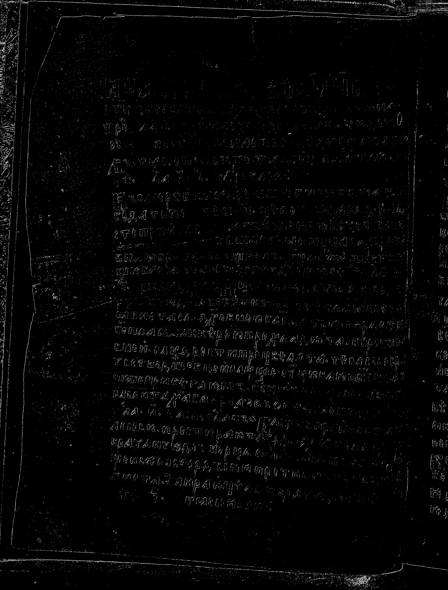
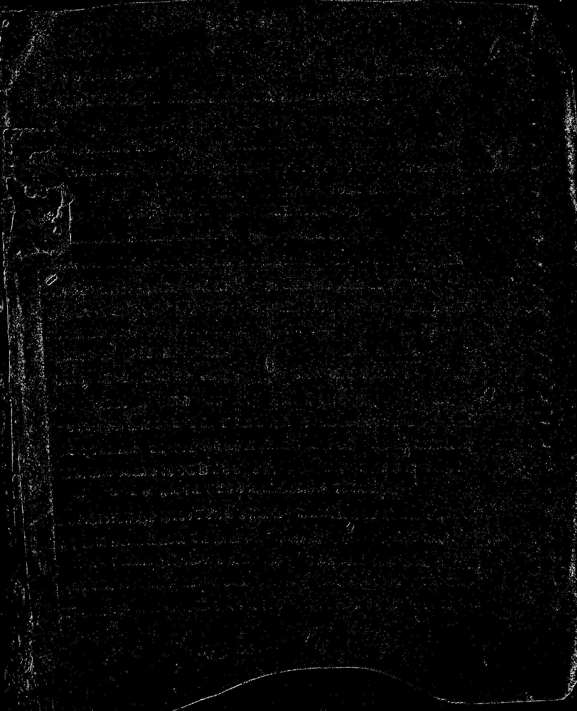
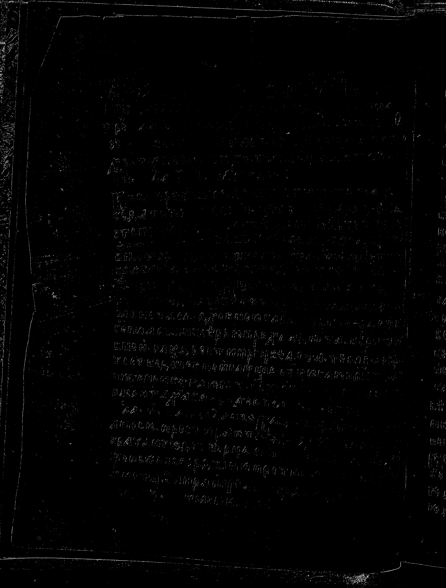
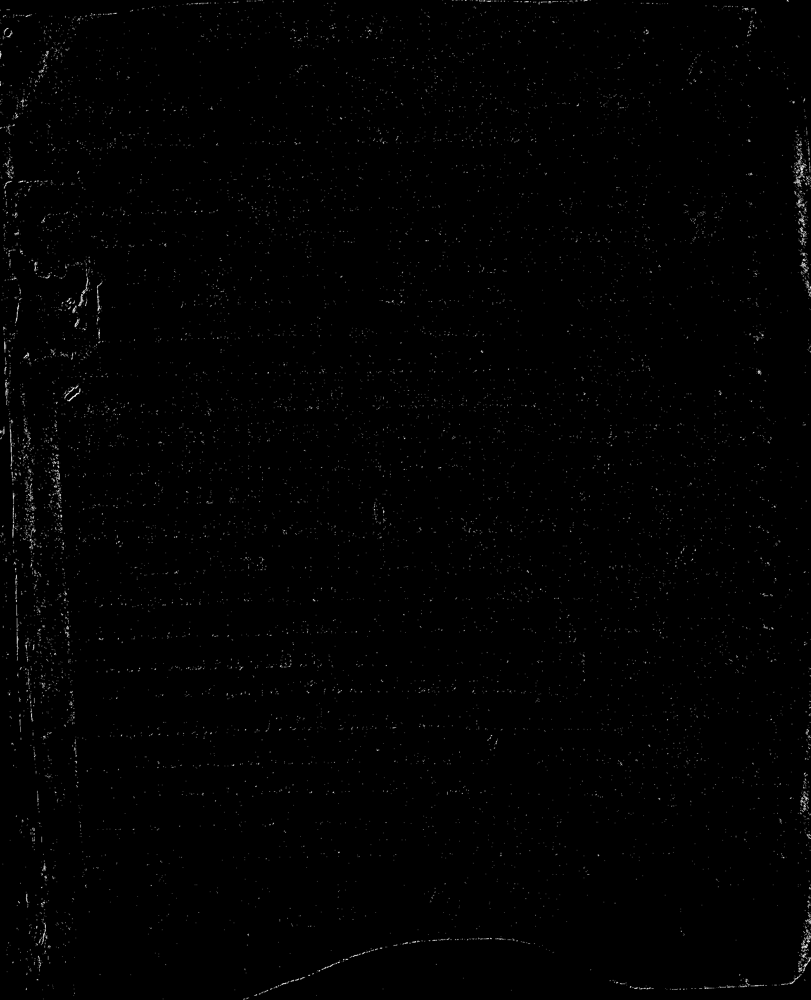
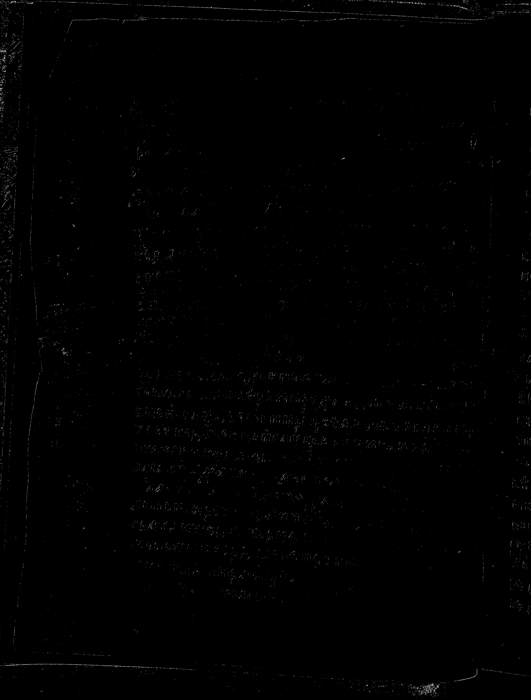

# Лабораторная работа №4
## Вариант 1. Выделение контуров оператором Робертса 2×2

Для изображений `01.png` и `02.png` выполнены перевод в полутоновое изображение, вычисление градиентных составляющих `Gx`, `Gy`, модуля градиента `G` и бинарной карты контуров. Порог бинаризации: `T = 35`.

Проведен эксперимент с несколькими порогами бинаризации `T = 25`, `35`, `45`, `55` [threshold_metrics.csv](lab4/threshold_metrics.csv).

### Изображение 01

| Исходное | Полутоновое | Бинарное |
|:--------:|:-----------:|:--------:|
|  |  |  |

| Gx | Gy | G |
|:--:|:--:|:--:|
|  |  |  |

### Изображение 02

| Исходное | Полутоновое | Бинарное |
|:--------:|:-----------:|:--------:|
|  |  |  |

| Gx | Gy | G |
|:--:|:--:|:--:|
|  |  |  |

### Эксперимент с разными порогами

Для сравнения порогов удобно смотреть на долю контурных пикселей: при слишком малом пороге контурная карта начинает захватывать шум и мелкие перепады фона, а при слишком большом пороге полезные контуры становятся редкими и рваными.

| Изображение | `T = 25` | `T = 35` | `T = 45` | `T = 55` |
|:----------:|---------:|---------:|---------:|---------:|
| `01.png` | 11.14% | 4.30% | 1.45% | 0.61% |
| `02.png` | 5.51% | 1.96% | 0.87% | 0.37% |

#### Порог `T = 25`

`01.png`

`02.png`

#### Порог `T = 35`

`01.png`

`02.png`

#### Порог `T = 45`

`01.png`

`02.png`

#### Порог `T = 55`

`01.png`

`02.png`

### Вывод

Для варианта 1 реализован оператор Робертса 2×2. Получены карты градиента по двум направлениям, модуль градиента и бинарные контурные изображения для двух исходных файлов. Дополнительно выполнен эксперимент с несколькими порогами бинаризации.

Наилучшим выбран порог `T = 35`, так как при нем контуры букв еще хорошо сохраняются, а шум фона уже заметно меньше, чем при `T = 25` и других.
