# Лабораторная работа №5
## Вариант 17. Казахские строчные буквы

Для варианта 17 сгенерированы эталонные изображения казахских строчных букв. Использован один шрифт `Arial`, кегль `52`; Для каждого символа рассчитаны скалярные признаки и построены профили `X` и `Y`.

Основные артефакты:

- CSV со скалярными признаками: [features_variant17.csv](lab5/features_variant17.csv)
- Эталонные изображения: [symbols_png](lab5/symbols_png)
- Профили `X`: [profiles_x_png](lab5/profiles_x_png)
- Профили `Y`: [profiles_y_png](lab5/profiles_y_png)

### Примеры эталонных символов

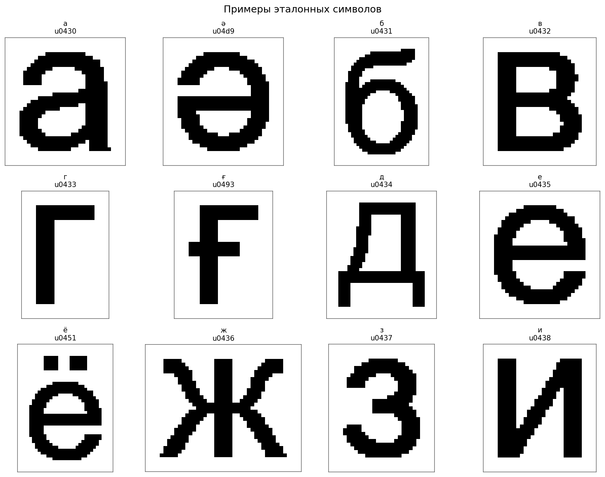

### Примеры профилей

| Символ | Эталон | Профиль X | Профиль Y |
|:--:|:--:|:--:|:--:|
| `а` | 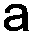 | 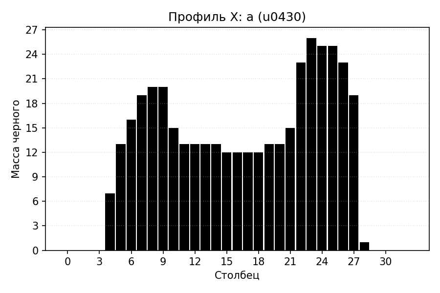 | 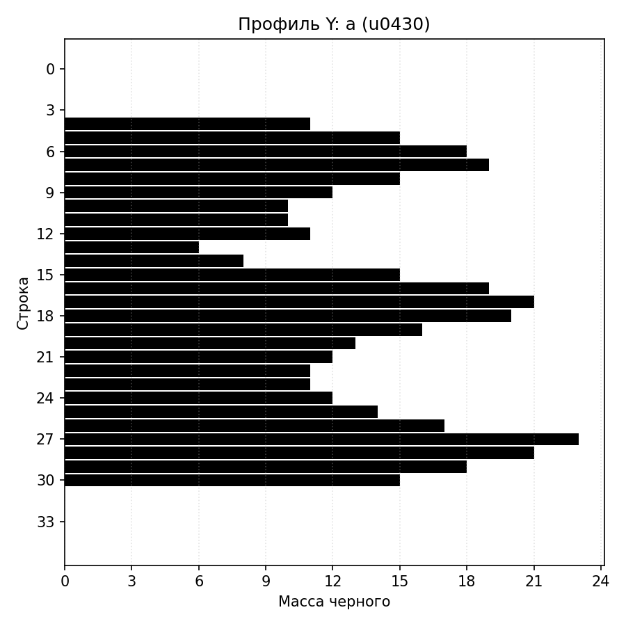 |
| `ә` |  | 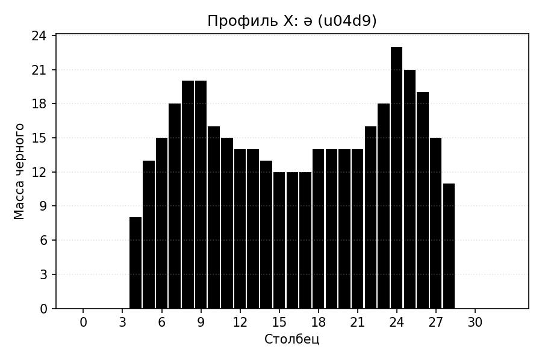 | 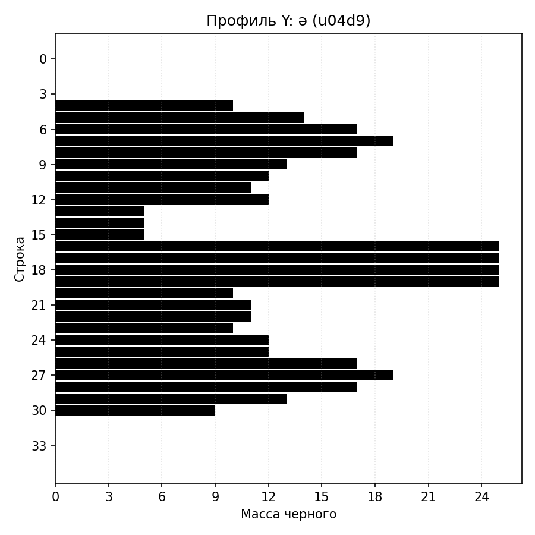 |
| `қ` |  | 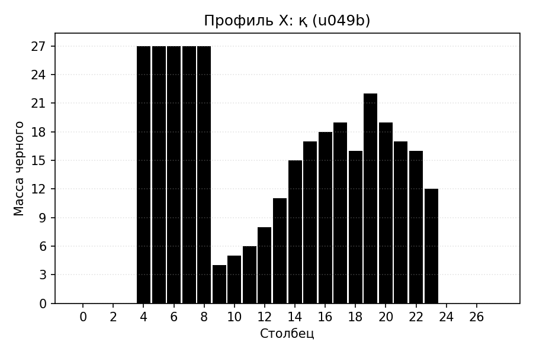 | 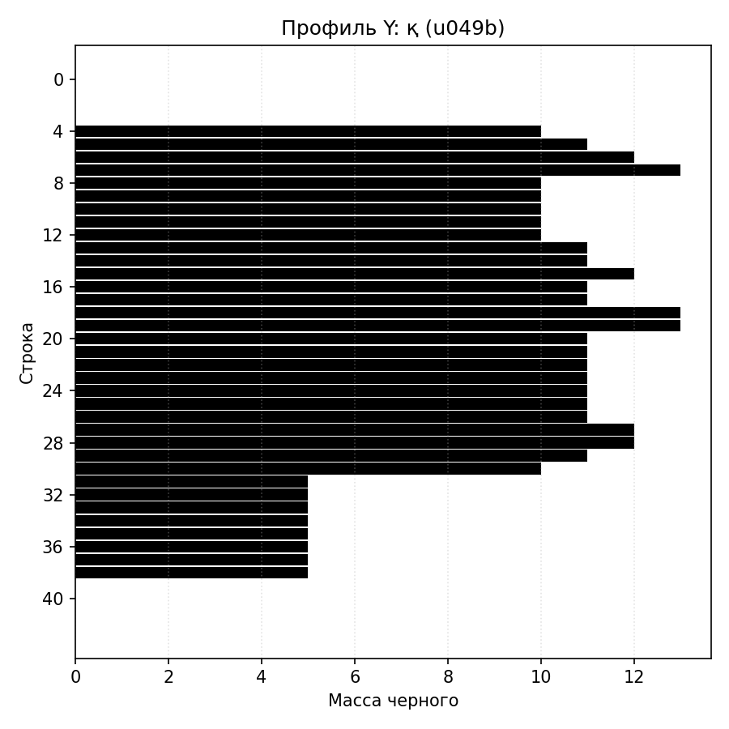 |
| `ң` | 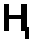 | 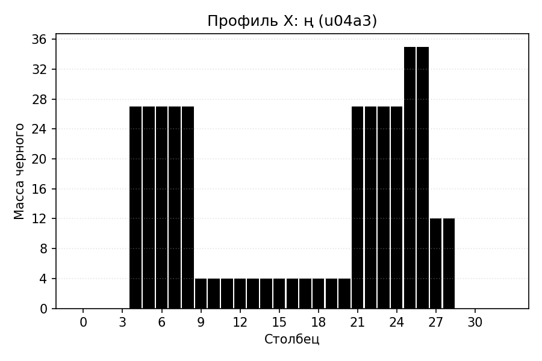 | 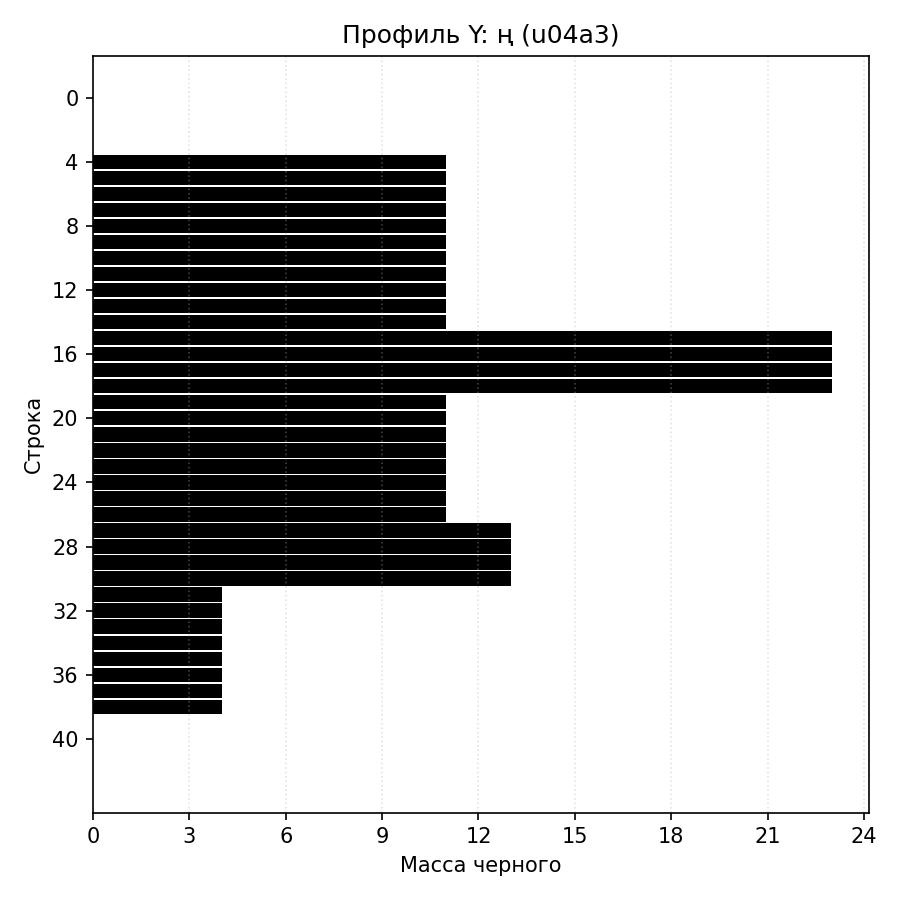 |

### Вычисленные признаки

Для каждого символа в `csv` сохранены:

- масса черного по четвертям изображения;
- удельная масса по четвертям;
- координаты центра тяжести и их нормированные значения;
- осевые моменты инерции по горизонтали и вертикали;
- нормированные осевые моменты инерции.

### Фрагмент результатов CSV

#### 1. Размеры изображения и общая масса

| Символ | Код | Ширина | Высота | Общая масса |
|:--:|:--:|--:|--:|--:|
| `а` | `u0430` | 33 | 35 | 393 |
| `ә` | `u04d9` | 33 | 35 | 381 |
| `б` | `u0431` | 34 | 46 | 492 |
| `в` | `u0432` | 31 | 35 | 404 |
| `г` | `u0433` | 24 | 35 | 179 |

#### 2. Нормированные координаты центра тяжести и инерция

| Символ | `centroid_x_norm` | `centroid_y_norm` | `inertia_horizontal_norm` | `inertia_vertical_norm` |
|:--:|--:|--:|--:|--:|
| `а` | 0.520356 | 0.519234 | 0.055418 | 0.050436 |
| `ә` | 0.510827 | 0.502702 | 0.050931 | 0.051161 |
| `б` | 0.481831 | 0.497787 | 0.060476 | 0.056142 |
| `в` | 0.469719 | 0.503058 | 0.058133 | 0.054471 |
| `г` | 0.346369 | 0.416858 | 0.061054 | 0.029927 |

#### 3. Распределение массы по четвертям

| Символ | `q1_top_left_mass` | `q2_top_right_mass` | `q3_bottom_left_mass` | `q4_bottom_right_mass` |
|:--:|--:|--:|--:|--:|
| `а` | 67 | 102 | 107 | 117 |
| `ә` | 74 | 91 | 104 | 112 |
| `б` | 143 | 115 | 119 | 115 |
| `в` | 101 | 91 | 106 | 106 |
| `г` | 77 | 32 | 70 | 0 |

По этим строкам уже видно, что признаки хорошо отражают форму символов: например, у буквы `г` масса в правой нижней четверти равна нулю, что соответствует ее открытому контуру, а у `б` больше общая масса и высота по сравнению с соседними символами.

### Вывод

Сформирован набор эталонных символов и рассчитан требуемый набор признаков.
