# Лабораторная работа №6
## Вариант 17. Сегментация текста для казахского алфавита

Для варианта 17 использован шрифт `Arial`, размер `52`. В качестве строки для сегментации выбрана фраза `сәулем мен сені сүйемін`.

Основные артефакты:

- исходная строка в `bmp`: [source_bmp](lab6/source_bmp)
- координаты обрамляющих прямоугольников: [segments_variant17.csv](lab6/segments_variant17.csv)
- вырезанные символы: [segmented_symbols_png](lab6/segmented_symbols_png)
- профили строки: [profiles_png](lab6/profiles_png)
- профили символов алфавита: [alphabet_profiles_x_png](lab6/alphabet_profiles_x_png), [alphabet_profiles_y_png](lab6/alphabet_profiles_y_png)

### Исходная строка

### Горизонтальный и вертикальный профили строки

Горизонтальный профиль показывает распределение черных пикселей по строкам, а вертикальный — по столбцам. Именно вертикальный профиль используется для разбиения строки на отдельные символы.

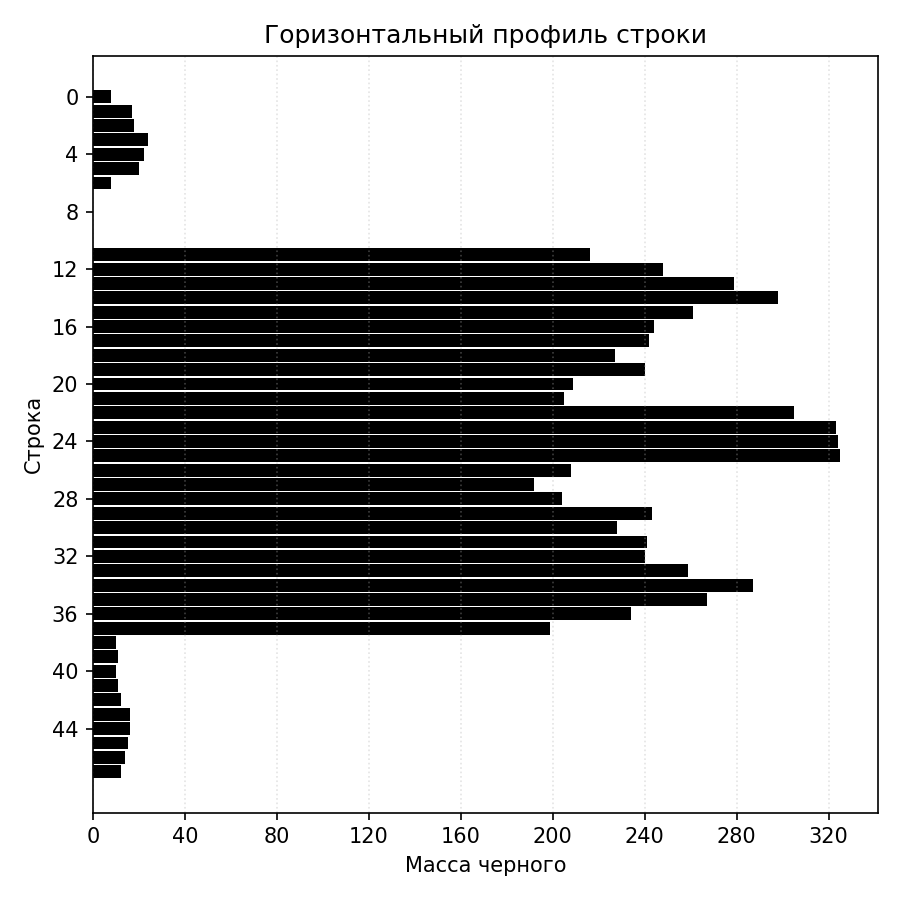

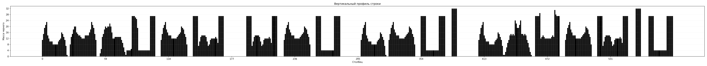

### Результат сегментации

Сегментация выполнена по вертикальному профилю с порогом `1` пиксель. На выходе получено `20` обрамляющих прямоугольников

#### Прямоугольники на строке

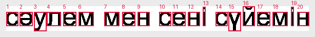

#### Вырезанные символы

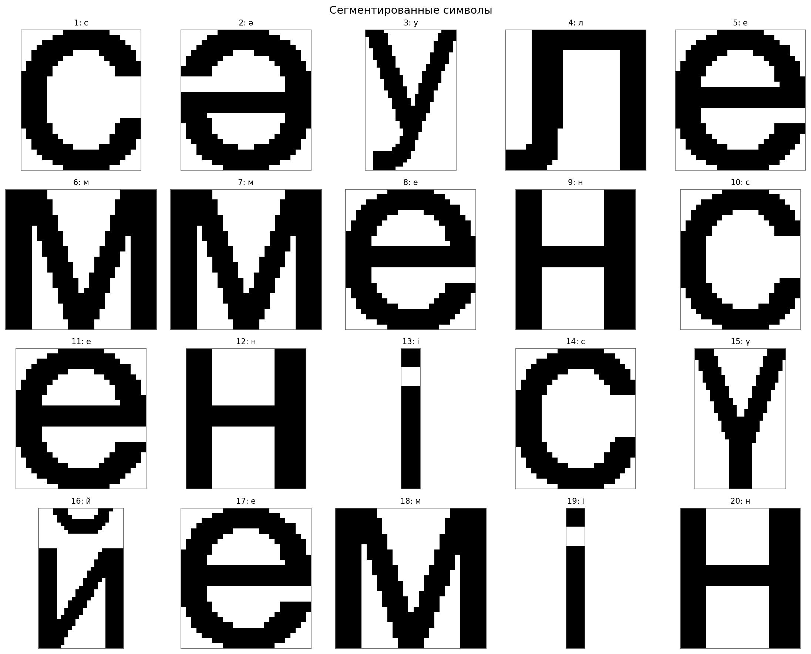

### Фрагмент CSV с координатами сегментов

Первые 8 сегментов из [segments_variant17.csv](lab6/segments_variant17.csv):

| № | Символ | Код | `left` | `top` | `right` | `bottom` | `width` | `height` |
|--:|:------:|:---:|------:|-----:|-------:|--------:|--------:|---------:|
| 1 | `с` | `u0441` | 0 | 11 | 23 | 38 | 23 | 27 |
| 2 | `ә` | `u04d9` | 26 | 11 | 51 | 38 | 25 | 27 |
| 3 | `у` | `u0443` | 54 | 11 | 78 | 48 | 24 | 37 |
| 4 | `л` | `u043b` | 79 | 11 | 106 | 38 | 27 | 27 |
| 5 | `е` | `u0435` | 111 | 11 | 136 | 38 | 25 | 27 |
| 6 | `м` | `u043c` | 141 | 11 | 170 | 38 | 29 | 27 |
| 7 | `м` | `u043c` | 191 | 11 | 220 | 38 | 29 | 27 |
| 8 | `е` | `u0435` | 226 | 11 | 251 | 38 | 25 | 27 |

### Профили символов выбранного алфавита

Для всех букв казахского алфавита построены отдельные профили `X` и `Y`. Ниже приведены несколько характерных примеров.

| Символ | Изображение | Профиль X | Профиль Y |
|:--:|:--:|:--:|:--:|
| `ә` |  | 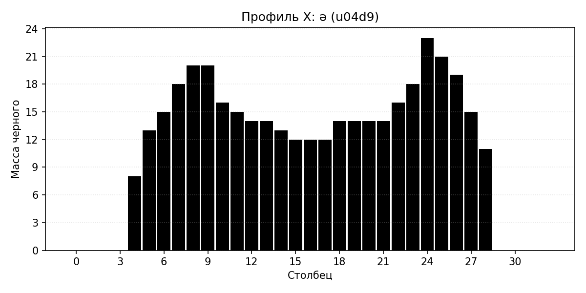 |  |
| `ү` |  | 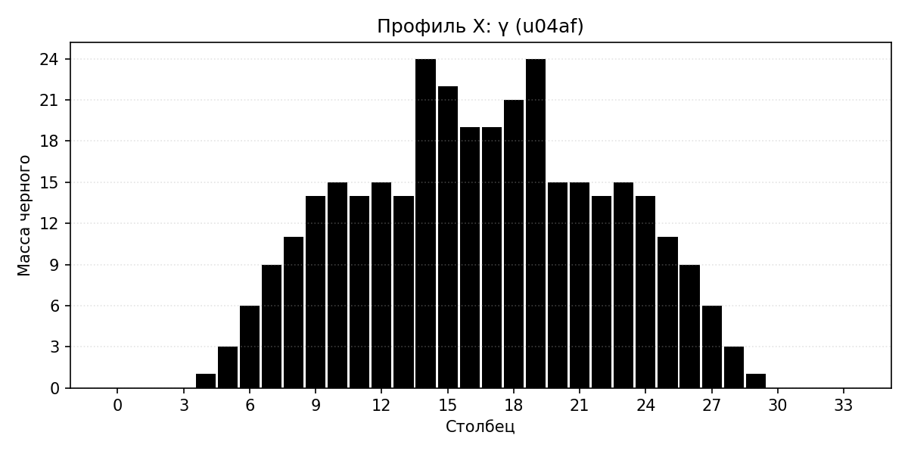 | 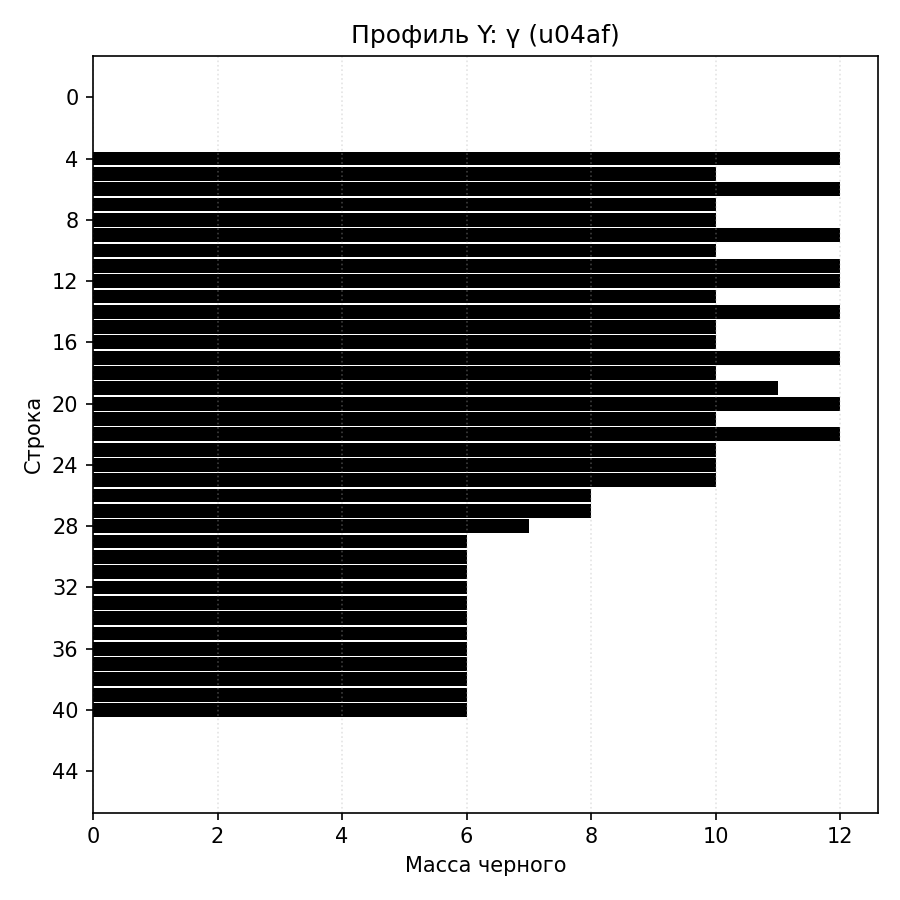 |
| `і` |  | 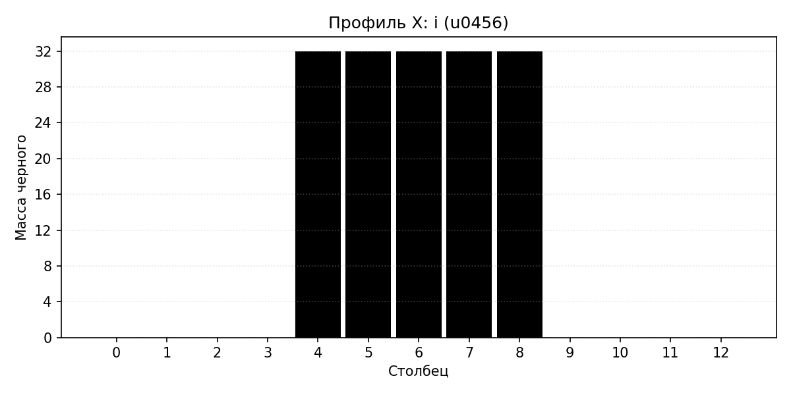 | 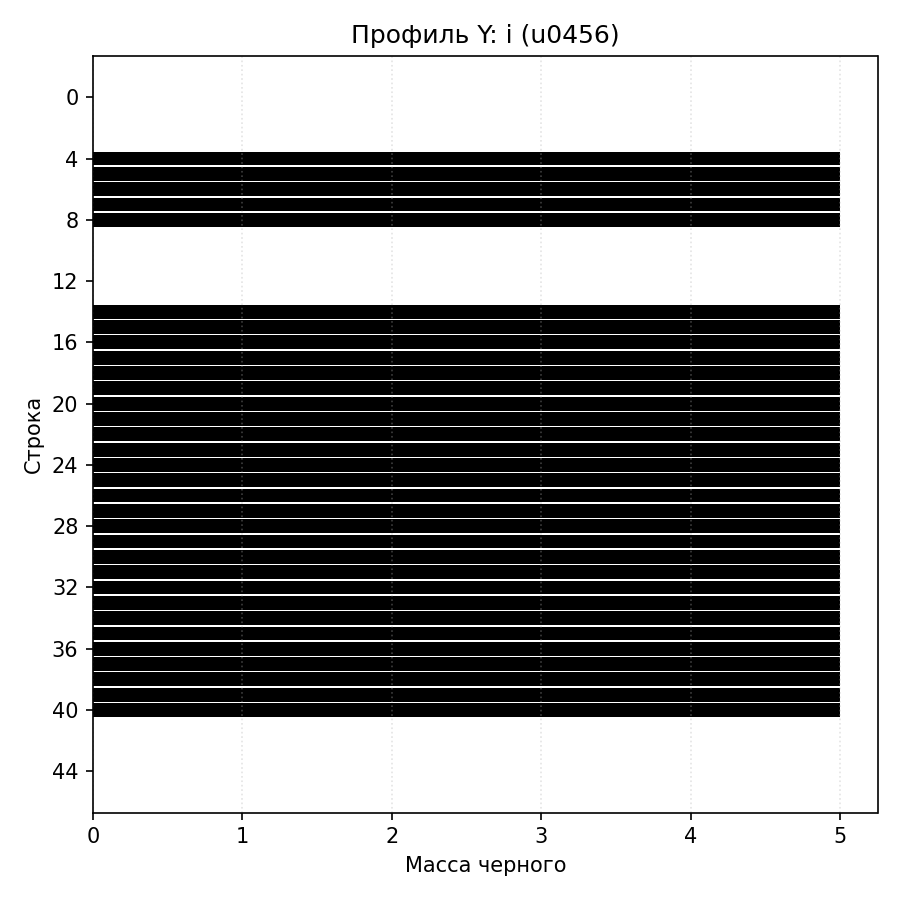 |
| `ң` |  | 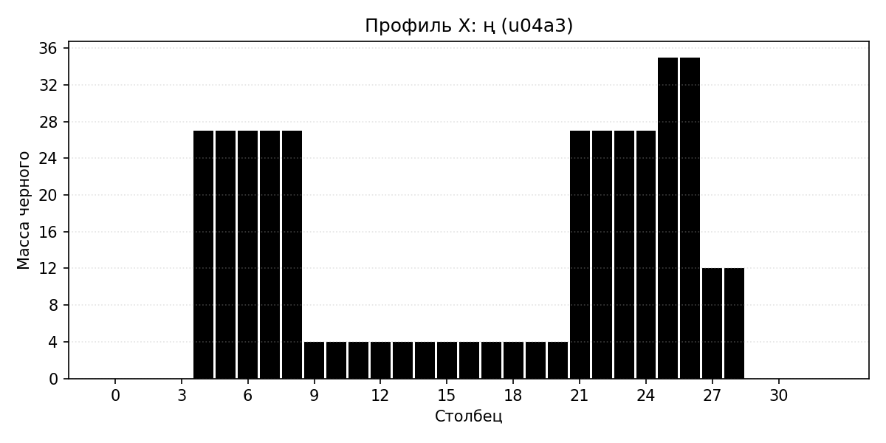 |  |

#### Обзор части алфавита

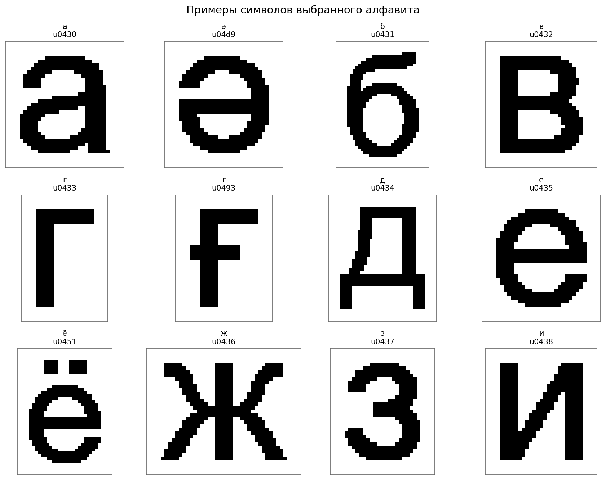

### Вывод

Для варианта 17 сформирована строка `сәулем мен сені сүйемін` в монохромном виде, построены горизонтальный и вертикальный профили, а также реализована сегментация символов по профилям.
