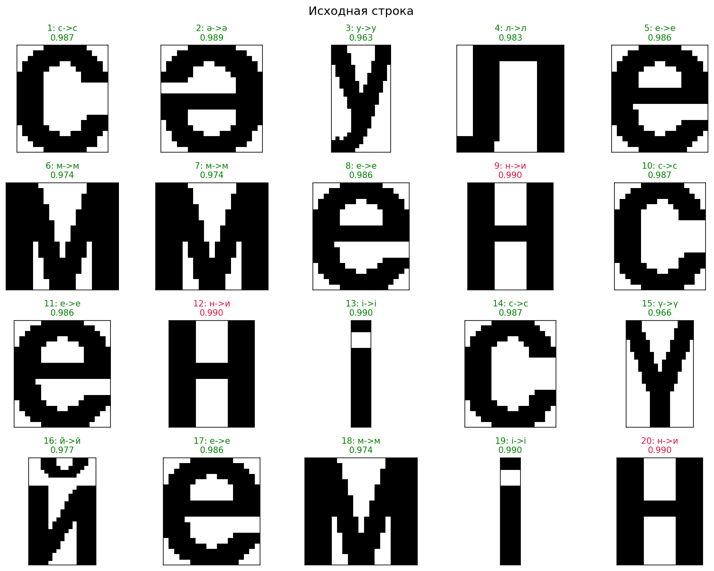
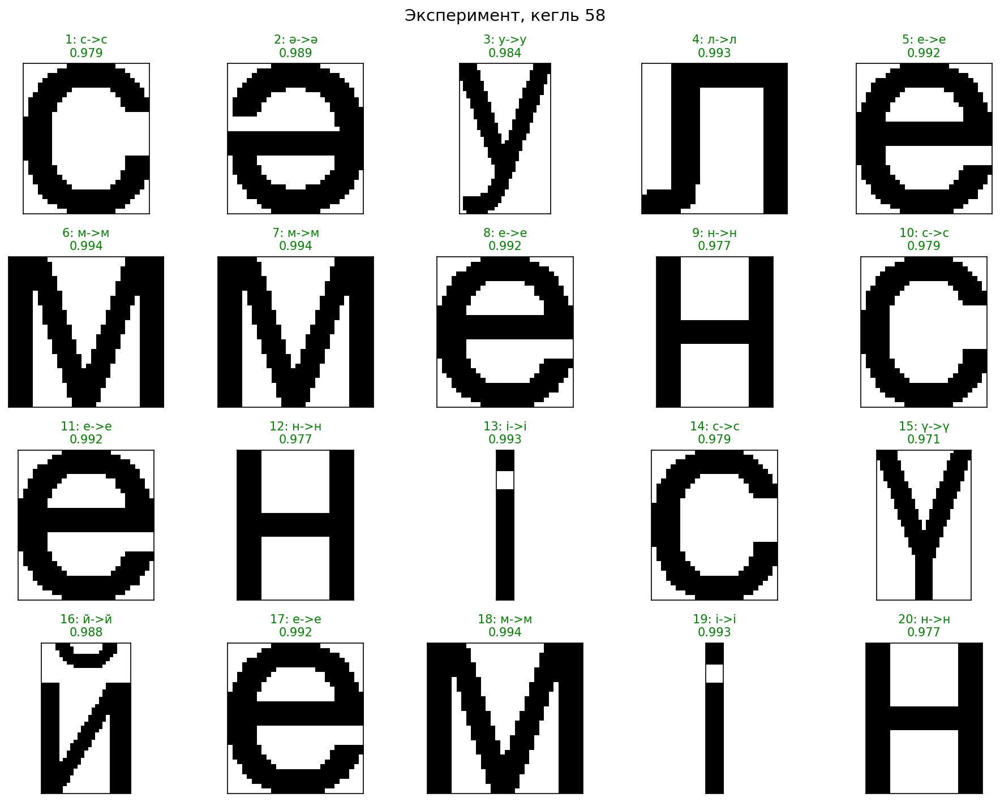

# Лабораторная работа №7
## Вариант 17. Классификация казахских строчных букв

Для варианта 17 использованы результаты лабораторных работ 5 и 6: эталонные буквы казахского алфавита и сегменты строки `сәулем мен сені сүйемін`.

### Метод

Для каждого символа считается вектор нормализованных признаков:

`масса, x центра тяжести, y центра тяжести, горизонтальный момент инерции, вертикальный момент инерции`.

Мера близости считается через евклидово расстояние:

`similarity = 1 / (1 + distance)`.

Так как исходный BMP из 6-й лабораторной имеет более толстый штрих, для признаков использованы веса:

`mass=0.1, centroid_x=1, centroid_y=1, inertia_h=2, inertia_v=2`.

### Исходная строка

Ожидаемая строка без пробелов: `сәулемменсенісүйемін`

Распознанная строка: `сәулем меи сеиі сүйеміи`

Ошибок: `3` из `20`

Верно распознано: `85.0%`

Фрагмент лучших гипотез:

| № | Ожидалось | Распознано | Мера близости |
|--:|:--:|:--:|--:|
| 1 | `с` | `с` | 0.987279 |
| 2 | `ә` | `ә` | 0.988672 |
| 3 | `у` | `у` | 0.962845 |
| 4 | `л` | `л` | 0.983489 |
| 5 | `е` | `е` | 0.986455 |

### Эксперимент

Для эксперимента та же строка сгенерирована шрифтом `Arial`, но кеглем `58` вместо `52`.

Распознанная строка: `сәулем мен сені сүйемін`

Ошибок: `0` из `20`

Верно распознано: `100.0%`

### Вывод

Классификация по нормализованным признакам работает корректно, но качество зависит от толщины штриха и способа получения изображения. Для исходного BMP получилось `85.0%`, а для строки с измененным кеглем, сгенерированной тем же способом, получилось `100.0%`.
