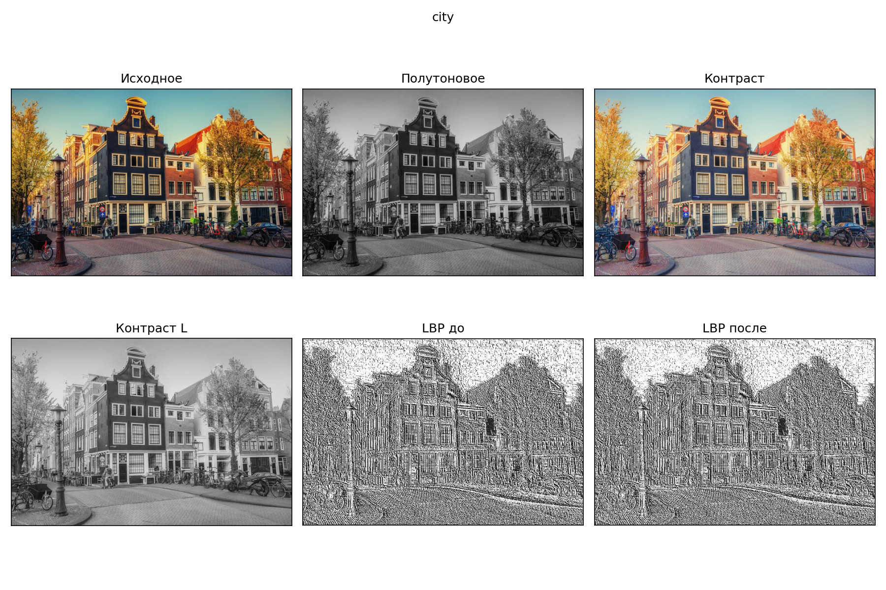
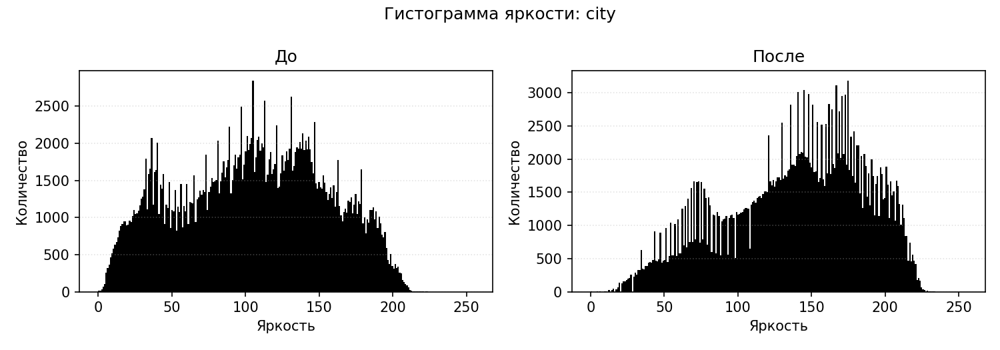
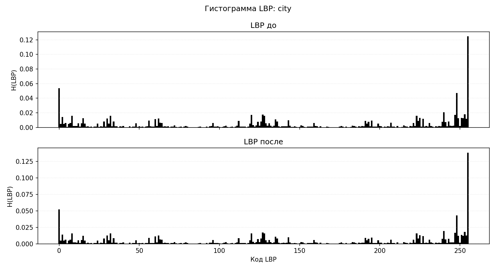
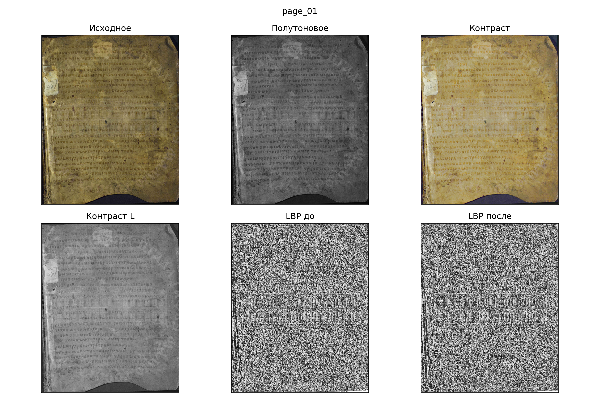
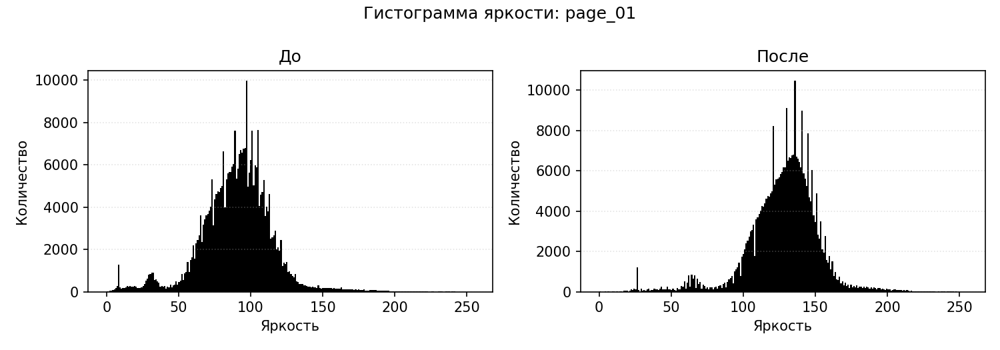
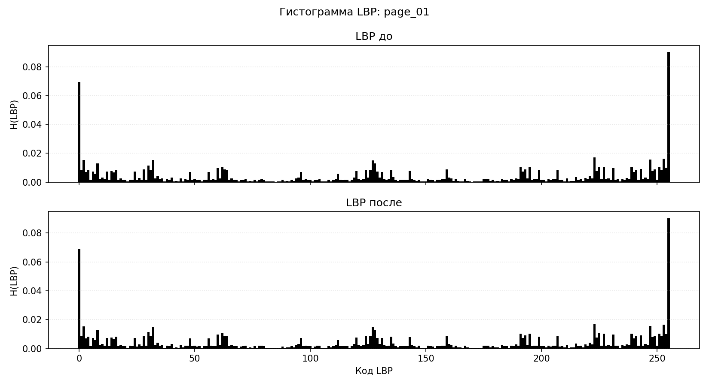
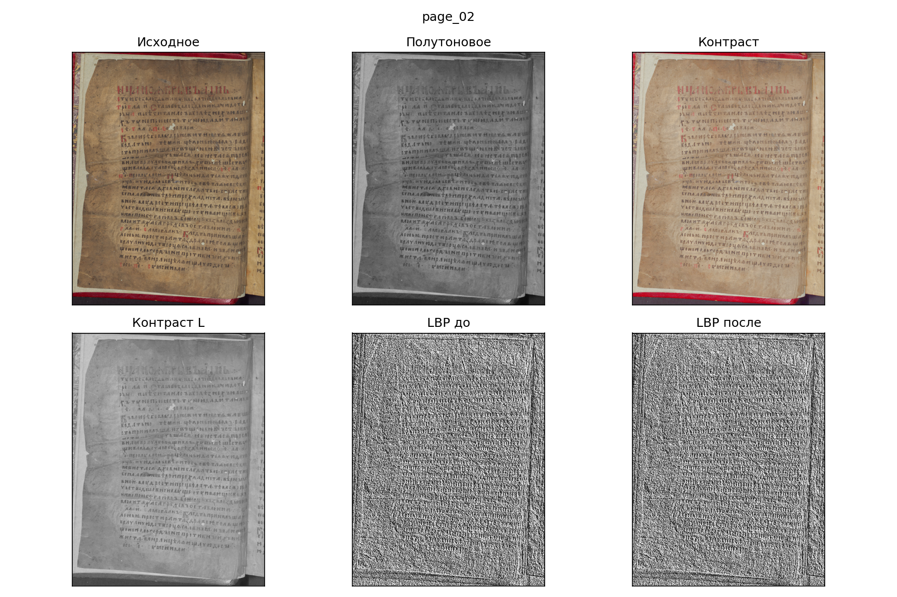
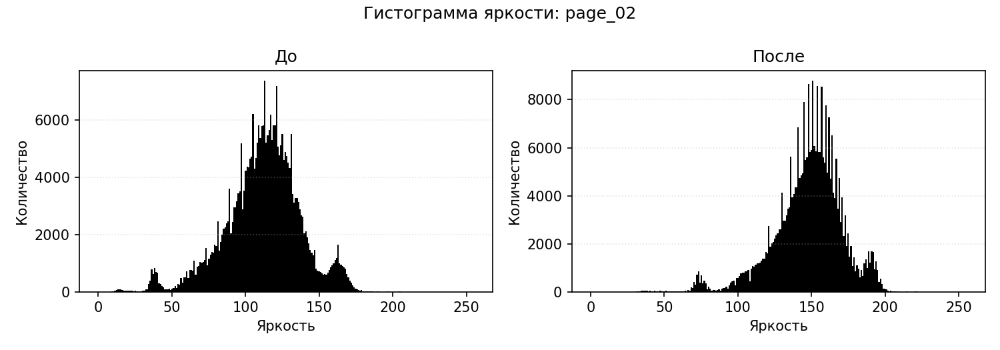
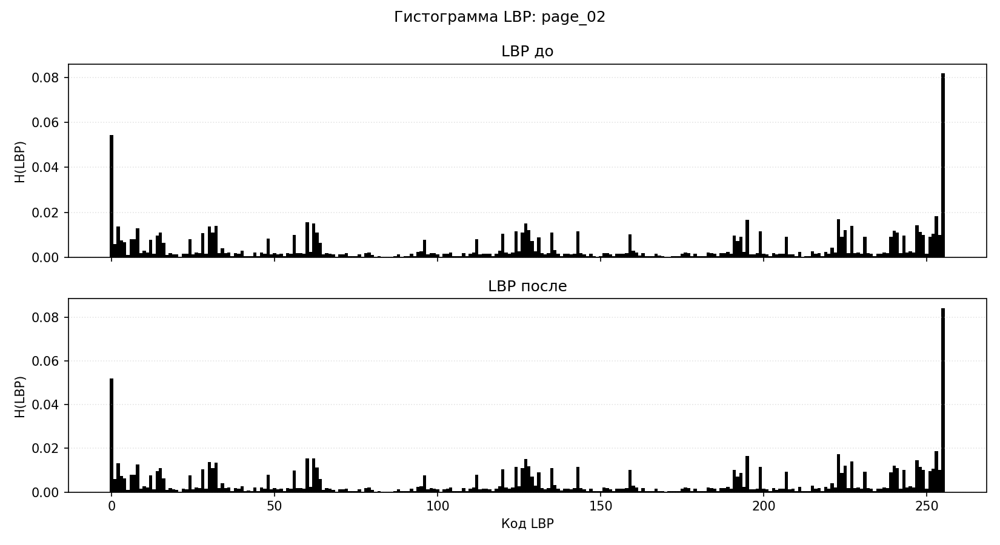

# Лабораторная работа №8
## Вариант 17

- матрица/метод: `LBP`;
- признак: `H(LBP)`;
- метод преобразования яркости: степенное преобразование.

### Метод

Для цветных изображений яркость изменялась в модели `HSL`: менялся только канал `L`, каналы `H` и `S` сохранялись.

Степенное преобразование:

`L2 = L^0.65`

Для анализа текстуры построены LBP-коды по окрестности `3x3`. Признак `H(LBP)` представлен нормированной гистограммой из `256` значений. Для краткого сравнения дополнительно посчитаны энтропия, однородность и расстояние между LBP-гистограммами.

### Результаты

| Изображение | Энтропия до | Энтропия после | Однородность до | Однородность после | Расстояние H(LBP) |
|:--|--:|--:|--:|--:|--:|
| `city` | 6.559433 | 6.520404 | 0.027307 | 0.030190 | 0.000631 |
| `page_01` | 6.961132 | 6.964277 | 0.018928 | 0.018828 | 0.000034 |
| `page_02` | 6.890581 | 6.885881 | 0.016910 | 0.017076 | 0.000208 |

### Изображение `city`

### Изображение `page_01`

### Изображение `page_02`

### Вывод

Степенное преобразование яркости осветляет изображения и сдвигает гистограмму яркости. LBP-гистограммы меняются слабо, потому что LBP в основном описывает локальные отношения соседних пикселей, а не абсолютную яркость.
