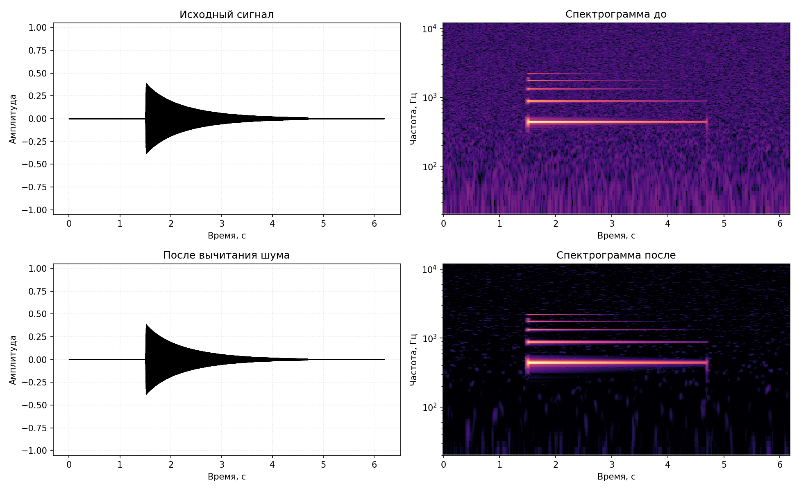
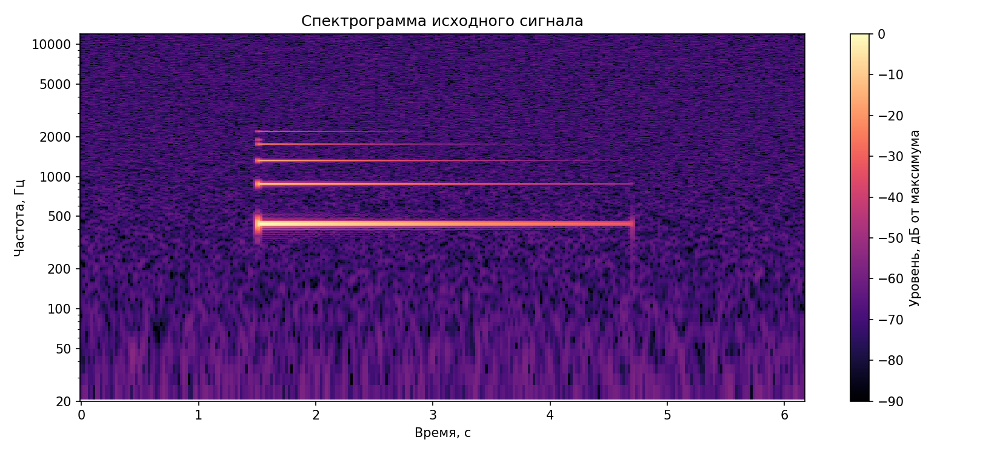
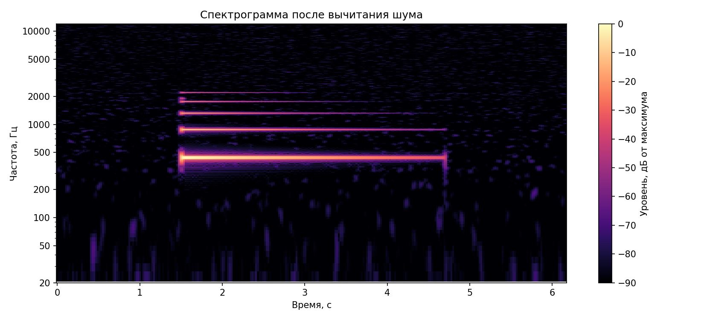
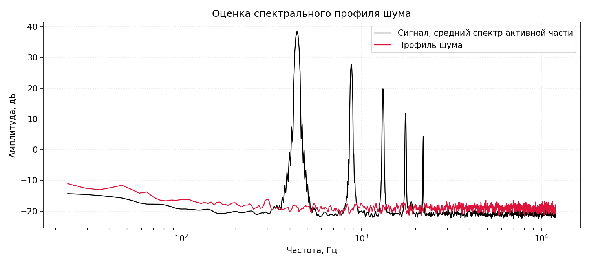
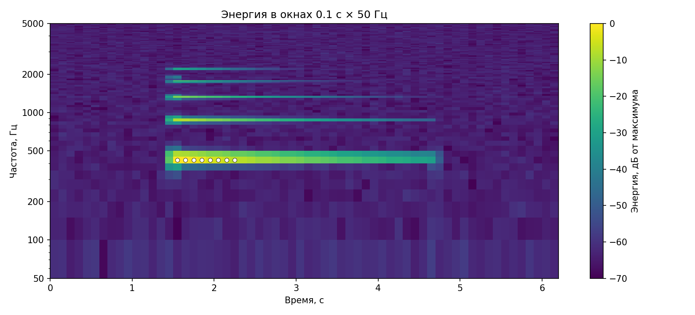

# Лабораторная работа №9
## Вариант 17. Анализ шума

Для анализа использована запись `piano_A4_mono_48k_16bit_pcm.wav`: синтезированное фортепиано, одна нота `A4 / Ля первой октавы`, ожидаемая частота `440 Гц`. Запись одноканальная, `48 кГц`, `16-bit PCM`; в начале и конце есть участки фонового шума. Отдельно использован файл шума `room_noise_only_mono_48k_16bit_pcm.wav`.

### Метод

Спектрограммы построены оконным преобразованием Фурье с окном Ханна:

- размер окна: `4096` отсчетов;
- шаг окна: `1024` отсчета;
- `NFFT = 8192`;
- шаг по частоте: `5.859 Гц`.

Шум оценивался по отдельной записи комнатного шума. Для восстановления звука использовано спектральное вычитание: из амплитудного спектра исходного сигнала вычитался медианный спектральный профиль шума, после чего сигнал восстанавливался обратным STFT.

### Результаты

| Параметр | Значение |
|:--|--:|
| Длительность записи | `6.2 с` |
| Активная часть ноты | `1.45–4.60 с` |
| RMS фонового шума до обработки | `0.00261479` |
| RMS фонового шума после обработки | `0.00031215` |
| Подавление фонового шума | `18.461 дБ` |
| SNR до обработки | `30.422 дБ` |
| SNR после обработки | `48.865 дБ` |
| Прирост SNR | `18.443 дБ` |
| Найденная частота ноты | `439.453 Гц` |
| Ошибка относительно 440 Гц | `-0.547 Гц` |

### Сигнал и спектрограммы

#### Спектрограмма до обработки

#### Спектрограмма после вычитания шума

### Оценка шума

### Энергия в окнах `0.1 с × 50 Гц`

Максимальная энергия обнаружена в окне `1.6–1.7 с` и частотной полосе `400–450 Гц`, что соответствует основной частоте ноты `A4`.

| Ранг | Время, с | Полоса, Гц | Отн. энергия, дБ |
|--:|:--:|:--:|--:|
| 1 | `1.6–1.7` | `400–450` | `0.000` |
| 2 | `1.5–1.6` | `400–450` | `-0.521` |
| 3 | `1.7–1.8` | `400–450` | `-1.212` |
| 4 | `1.8–1.9` | `400–450` | `-2.378` |
| 5 | `1.9–2.0` | `400–450` | `-4.381` |

### Вывод

Для записи ноты `A4` построены спектрограммы до и после обработки. По отдельному образцу комнатного шума выполнено спектральное вычитание и восстановлена звуковая дорожка. После обработки RMS фонового шума уменьшился примерно на `18.5 дБ`, а отношение сигнал/шум выросло с `30.4 дБ` до `48.9 дБ`. Основная частота найдена как `439.453 Гц`, что близко к теоретическому значению `440 Гц`.
